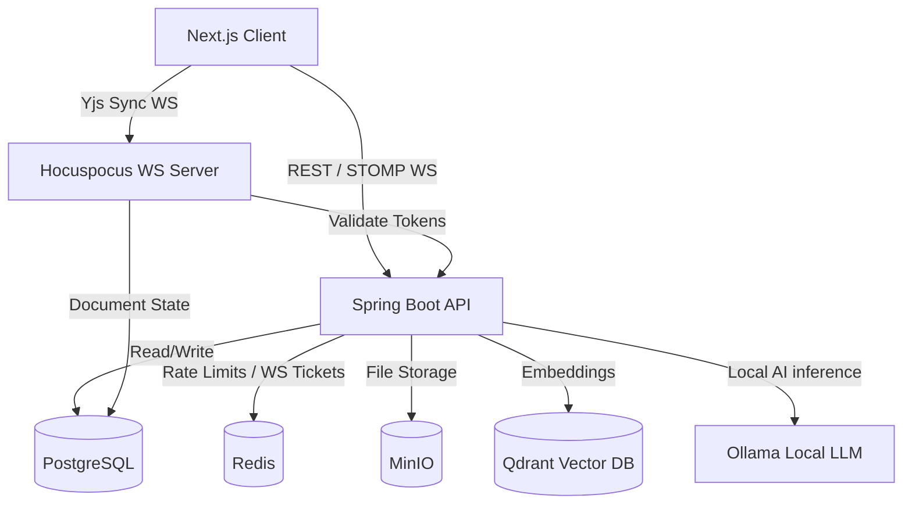

# Nexus OS
> A real-time collaborative workspace platform with chat, kanban boards, live document editing, and local-first AI assistance.

## Overview
Nexus OS is a comprehensive workspace application designed for seamless team collaboration. It moves beyond generic chat applications by integrating task management (Kanban), deeply collaborative document editing (CRDT-based), and an AI assistant capable of reasoning over your workspace data. 

Engineered for data privacy and resilience, Nexus OS defaults to local-first AI processing via Ollama, with an optional OpenAI fallback. It is built as a robust modular monolith on the backend with a modern, responsive Next.js App Router frontend, featuring secure ticket-based WebSocket communication.

## Key Features
- **Real-Time Chat**: STOMP over WebSockets for instant messaging.
- **Collaborative Documents**: Real-time rich text editing powered by Tiptap and Yjs (CRDTs).
- **Kanban Task Boards**: Drag-and-drop project management integrated directly into workspaces.
- **Local-First AI Assistant**: Secure, local vector ingestion and querying using Ollama and Qdrant.
- **Secure File Management**: Fast, S3-compatible file storage powered by MinIO.
- **Admin Dashboard**: System-wide statistics and user management.
- **Robust Security**: Ticket-based WebSocket authentication, strict RBAC, and rate limiting.

## Architecture



## Tech Stack

| Layer | Technology | Purpose |
|-------|------------|---------|
| **Frontend** | Next.js (React), TailwindCSS, Tiptap | UI rendering, rich text editing, responsive design |
| **Backend** | Java 21, Spring Boot, Spring Security | Core business logic, REST APIs, WebSocket (STOMP) |
| **Database** | PostgreSQL, Flyway | Relational data persistence and schema migrations |
| **Caching/KV** | Redis | Rate limiting, WebSocket tickets, short-lived cache |
| **Real-time Sync**| Hocuspocus / Yjs | CRDT-based document synchronization |
| **Object Store** | MinIO | S3-compatible file and media storage |
| **Vector DB** | Qdrant | Fast, scalable storage for AI embeddings |
| **AI Engine** | Ollama / OpenAI | Local-first LLM inference and embedding generation |

## Getting Started

### Prerequisites
- Docker and Docker Compose
- Node.js 20+ (for local frontend dev)
- Java 21 (for local backend dev)

### Running via Docker
1. Clone the repository:
   ```bash
   git clone https://github.com/your-org/nexus-os.git
   cd nexus-os
   ```
2. Configure environment variables:
   ```bash
   cp .env.example .env
   # Edit .env and supply required keys
   ```
3. Start the infrastructure and applications:
   ```bash
   docker compose up -d
   ```
   The platform will be available at `http://localhost:3000`.

### Environment Variables

| Variable | Purpose | Example / Default | Required |
|----------|---------|-------------------|----------|
| `OPENAI_API_KEY` | Key for cloud AI fallback and embeddings | `sk-...` | Yes (if not using Ollama) |
| `POSTGRES_PASSWORD`| Database password | `SuperStrongPass123!` | No (defaults provided) |
| `MINIO_ROOT_PASSWORD`| MinIO admin password | `SuperStrongPass123!` | No |
| `NEXUSOS_JWT_SECRET` | Secret for signing auth tokens | `change-me-in-production` | Yes (for production) |
| `INTERNAL_API_SECRET`| Secures Hocuspocus -> API calls | `dev-internal-secret` | Yes (for production) |

## Project Structure
```text
nexus-os/
├── apps/
│   ├── api/          # Spring Boot backend application
│   └── web/          # Next.js frontend application
├── docs/             # Architecture diagrams and decision records
├── docker-compose.yml# Multi-container orchestration
└── hocuspocus.*.js   # Configuration for the CRDT sync server
```

## Core Concepts

- **WebSocket Ticket Authentication**: Instead of passing JWTs in the URI query string (which can be leaked in server logs), the frontend exchanges a valid JWT via REST for a short-lived ticket, which is then used to establish the STOMP connection.
- **Local-First AI**: By default, ingestion and chatting hit a locally running Ollama container. This prevents sensitive workspace data from leaving your infrastructure.
- **CRDT Document Sync**: Real-time editing is extremely robust because it uses Conflict-free Replicated Data Types (Yjs). Changes merge deterministically, even if clients temporarily lose connection.

## Security Notes
- **RBAC**: Strict separation between Workspace Owners, Members, and System Admins.
- **Rate Limiting**: IP-based and User-based dual rate limiting via Bucket4j and Redis.
- **Internal API Secret**: The Hocuspocus Node.js server verifies document permissions by calling the Spring API using a pre-shared internal secret, ensuring users cannot spoof document IDs.

## Known Limitations / Roadmap
> **Architectural Audit (July 2026):** This project recently underwent a ruthless production architecture audit. It is currently rated as **Early MVP** and is **NOT** ready for production. 

**Critical issues that must be addressed before production deployment:**
- **CRDT Event Storms**: Hocuspocus currently executes synchronous HTTP PATCH operations to the database on every document change. This must be debounced via a background job to prevent DB deadlocks.
- **Rate Limit Memory Exhaustion**: The `RateLimitFilter` buffers entire request bodies into JVM memory. This introduces a severe Out-of-Memory (OOM) Denial of Service risk that must be rewritten to parse streams or headers.
- **WebSocket Scaling & Leaks**: The `WsTicketService` uses an unbounded `ConcurrentHashMap` for fallback tickets, breaking horizontal scaling and causing memory leaks. Hocuspocus lacks a Redis PubSub backplane.
- **AI Context Overflow**: `AiService` naively concatenates raw documents for RAG without token counting, leading to immediate context window overflows. Calls are also blocking Tomcat threads via `.join()`.
- **SSRF / IP Whitelisting**: Internal APIs blindly trust the `10.0.0.0/8` subnet, making the cluster vulnerable to privilege escalation via SSRF.

**Planned Roadmap:**
- Complete rewrite of `RateLimitFilter` and internal API authentication.
- Implementation of Spring WebFlux for non-blocking AI inference.
- Redis PubSub integration for horizontal Hocuspocus scaling.
- Token-aware document chunking (e.g., using JTokkit).

## License
MIT License
