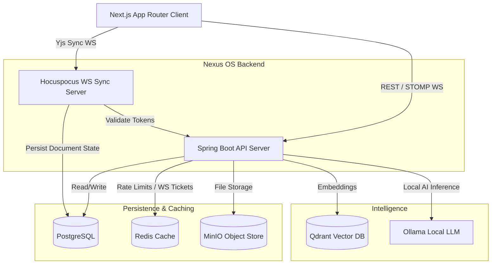

<div align="center">
  <h1>🌌 Nexus OS</h1>
  <p><strong>A real-time collaborative workspace platform with chat, kanban boards, live document editing, and local-first AI assistance.</strong></p>

  <p>
    
    
    
    
    
    
  </p>
</div>

<br />

## 📖 Table of Contents

- [Hero Section](#-hero-section)
- [Features](#-features)
- [Screenshots](#-screenshots)
- [Demo](#-demo)
- [Architecture Overview](#-architecture-overview)
- [Tech Stack](#-tech-stack)
- [Folder Structure](#-folder-structure)
- [Installation](#-installation)
- [Requirements](#-requirements)
- [Configuration](#-configuration)
- [Quick Start](#-quick-start)
- [Development](#-development)
- [Available Scripts](#-available-scripts)
- [API Documentation](#-api-documentation)
- [Database](#-database)
- [Authentication](#-authentication)
- [Security](#-security)
- [State Management](#-state-management)
- [Deployment](#-deployment)
- [Docker](#-docker)
- [CI/CD](#-cicd)
- [Testing](#-testing)
- [Performance](#-performance)
- [Monitoring & Logging](#-monitoring--logging)
- [Troubleshooting](#-troubleshooting)
- [Roadmap](#-roadmap)
- [Contributing](#-contributing)
- [Code Style](#-code-style)
- [License](#-license)
- [Credits](#-credits)
- [Support](#-support)

---

## 🚀 Hero Section

**Nexus OS** is a comprehensive, open-source workspace application engineered for seamless team collaboration. Moving beyond generic communication tools, Nexus OS seamlessly integrates real-time chat, visual project management (Kanban), deeply collaborative document editing, and an intelligent AI assistant capable of reasoning over your secure workspace data.

**Why does it exist?**
Modern teams are scattered across too many specialized tools—Slack for chat, Jira/Trello for tasks, Google Docs/Notion for documents, and ChatGPT for AI. This fragments context and data. Nexus OS unifies these primitives into a single, cohesive modular monolith, prioritizing data privacy and resilience by defaulting to local-first AI processing.

---

## ✨ Features

### 💬 Real-Time Communication
- **Instant Messaging**: Powered by STOMP over WebSockets.
- **Channels & Direct Messages**: Organize conversations efficiently.

### 📝 Collaborative Documents
- **Rich Text Editing**: Powered by Tiptap.
- **CRDT-based Live Sync**: Real-time multiplayer editing using Yjs and Hocuspocus. No conflict errors, even with unstable connections.

### 📋 Project Management
- **Kanban Boards**: Intuitive drag-and-drop task management integrated directly into your workspace.
- **Task Tracking**: Assignees, labels, and real-time status updates.

### 🤖 Intelligent AI Assistant
- **Local-First AI**: Secure, local vector ingestion and querying using Ollama and Qdrant. Your data never leaves your infrastructure unless you opt into cloud providers.
- **RAG (Retrieval-Augmented Generation)**: AI that understands your documents, tickets, and chats.

### 🔐 Security & Architecture
- **Ticket-Based WebSocket Auth**: Highly secure WS connection handshakes.
- **Role-Based Access Control (RBAC)**: Strict permission enforcement.
- **Advanced Rate Limiting**: IP and User-based dual rate limiting via Bucket4j and Redis.
- **S3-Compatible Storage**: Fast and secure media management via MinIO.

---

## 📸 Screenshots

> TODO: Add screenshots of the Chat Interface, Kanban Board, Document Editor, and AI Assistant pane.

---

## 🎬 Demo

- **Live Demo**: TODO: Add link to live deployment
- **Video Walkthrough**: TODO: Add YouTube/Loom link

---

## 🏗 Architecture Overview

Nexus OS is built as a robust modular monolith on the backend paired with a modern, responsive frontend.



---

## 🛠 Tech Stack

### Frontend
| Technology | Description |
|---|---|
| **Next.js 15** | React framework with App Router & Turbopack. |
| **React 19** | UI Library. |
| **TailwindCSS 4** | Utility-first styling. |
| **Shadcn UI & Base UI** | Accessible, customizable UI components. |
| **Tiptap & Yjs** | Rich-text editor and CRDT collaborative syncing. |

### Backend
| Technology | Description |
|---|---|
| **Java 21 & Spring Boot 3.3** | Core business logic, REST APIs, and STOMP WebSockets. |
| **Spring Security** | Authentication, authorization, and JWT processing. |
| **Spring AI** | Abstractions for integrating LLMs and Vector databases. |
| **Bucket4j & ShedLock** | Advanced rate limiting and distributed task locking. |
| **Node.js (Hocuspocus)** | Dedicated WebSocket server for Yjs document synchronization. |

### Data & Infrastructure
| Technology | Description |
|---|---|
| **PostgreSQL & Flyway** | Primary relational database and schema migrations. |
| **Redis** | High-performance cache, rate limiting, and WS ticketing. |
| **MinIO** | S3-compatible highly available object storage. |
| **Qdrant** | Extremely fast and scalable Vector Database for RAG. |
| **Ollama** | Local LLM runner for privacy-first AI features. |
| **Docker** | Containerization for consistent environments. |

---

## 📁 Folder Structure

```text
nexus-os/
├── apps/
│   ├── api/                  # Spring Boot Java Backend
│   │   ├── src/              # Java source code & application properties
│   │   ├── build.gradle.kts  # Gradle dependencies and build configuration
│   │   └── Dockerfile        # Backend container definition
│   │
│   └── web/                  # Next.js TypeScript Frontend
│       ├── src/              # React components, pages, and hooks
│       ├── package.json      # Node dependencies and scripts
│       └── Dockerfile        # Frontend container definition
│
├── scripts/                  # Automation and utility scripts
├── .env.example              # Template for environment variables
├── docker-compose.yml        # Orchestrates the entire local infrastructure
├── hocuspocus.config.js      # Configuration for the CRDT sync server
├── hocuspocus.server.js      # Entry point for the real-time doc server
└── render.yaml               # Infrastructure as Code (IaC) for Render deployment
```

---

## 💻 Requirements

To run this project locally, ensure you have the following installed:

- **OS**: Linux, macOS, or Windows (WSL2 recommended)
- **Docker & Docker Compose**: For running the complete stack easily.
- **Node.js**: `v20.x` or higher (for local frontend development).
- **Java**: `JDK 21` (for local backend development).
- **Memory**: Minimum 8GB RAM recommended (for running the DBs, AI models, and applications concurrently).

---

## ⚙️ Configuration

Environment variables control the behavior of the application. Copy the example file to get started:

```bash
cp .env.example .env
```

### Core Environment Variables

| Variable | Description | Default / Example | Required |
|----------|-------------|-------------------|----------|
| `NEXUSOS_JWT_SECRET` | Secret key used to sign Auth JWTs. | *Change in production* | Yes |
| `INTERNAL_API_SECRET`| Secures server-to-server calls (Hocuspocus -> API). | `dev-internal-secret` | Yes |
| `POSTGRES_USER` / `POSTGRES_PASSWORD` | PostgreSQL credentials. | `nexus` / `SuperStrongPass123!` | No |
| `MINIO_ROOT_USER` / `MINIO_ROOT_PASSWORD`| MinIO Admin credentials. | `nexus_minio` / `SuperStrongPass123!`| No |
| `OPENAI_API_KEY` | Optional cloud fallback for AI. | `sk-...` | Optional |
| `NEXT_PUBLIC_API_URL` | Public URL for the REST API. | `http://localhost:8080` | Yes |
| `NEXT_PUBLIC_HOCUSPOCUS_URL`| Public URL for the Document Sync WS. | `ws://localhost:1234` | Yes |

*⚠️ **Security Note**: Never commit your `.env` file or expose secrets in public repositories.*

---

## 🏃 Quick Start

The fastest way to get Nexus OS running is via Docker Compose.

1. **Clone the repository**
   ```bash
   git clone https://github.com/your-org/nexus-os.git
   cd nexus-os
   ```

2. **Setup Environment**
   ```bash
   cp .env.example .env
   # Update variables as needed
   ```

3. **Start the Infrastructure**
   This will pull images, build the applications, and spin up PostgreSQL, Redis, MinIO, Qdrant, Ollama, Hocuspocus, the API, and the Web client.
   ```bash
   docker compose up -d
   ```

4. **Access the App**
   Open your browser and navigate to: `http://localhost:3000`

---

## 🧑‍💻 Development

If you prefer to run the applications locally (outside of Docker) for faster iteration:

### 1. Start Backing Services
You still need the databases. Start them selectively:
```bash
docker compose up -d postgres redis minio createbuckets qdrant ollama hocuspocus
```

### 2. Run the Backend API (Spring Boot)
```bash
cd apps/api
./gradlew bootRun
```
*API will be available on `http://localhost:8080`*

### 3. Run the Frontend (Next.js)
```bash
cd apps/web
npm install
npm run dev
```
*Frontend will be available on `http://localhost:3000`*

---

## 📜 Available Scripts

Located in `apps/web/package.json`:

| Script | Command | Description |
|--------|---------|-------------|
| `npm run dev` | `next dev --turbopack` | Starts Next.js development server with Turbopack for fast HMR. |
| `npm run build` | `next build --turbopack` | Builds the application for production. |
| `npm run start` | `next start` | Starts the production server. |
| `npm run lint` | `eslint` | Runs ESLint to catch code issues. |
| `npm run typecheck`| `tsc --noEmit` | Validates TypeScript types across the codebase. |
| `npm run test` | `vitest run` | Runs unit and integration tests via Vitest. |
| `npm run e2e` | `playwright test` | Executes end-to-end browser tests via Playwright. |
| `npm run format` | `prettier --write .` | Formats code to maintain a consistent style. |

---

## 🌐 API Documentation

> TODO: Fill this section. (e.g., Swagger/OpenAPI UI is typically available at `http://localhost:8080/swagger-ui.html` when running Spring Boot with Springdoc).

---

## 🗄 Database

Nexus OS relies on **PostgreSQL** as its primary source of truth.
- **ORM / Data Access**: Spring Data JPA & Hibernate.
- **Migrations**: **Flyway** manages database schemas ensuring consistent state across environments.
- **Schema Management**: Migrations are applied automatically on application startup (`SPRING_FLYWAY_REPAIR_ON_MIGRATE="true"` is enabled for Docker resilience).

> TODO: Add Entity Relationship (ER) Diagram

---

## 🔐 Authentication

Authentication is handled securely to prevent common attack vectors:
1. **REST APIs**: Secured using standard **JWT** (JSON Web Tokens) passed in the `Authorization: Bearer` header.
2. **WebSockets (STOMP)**: Instead of passing JWTs in query parameters (which risk being logged), the client requests a short-lived, single-use **Ticket** via REST, and uses that ticket to establish the WebSocket connection.

---

## 🛡 Security

Production-grade security is baked into the architecture:
- **Rate Limiting**: `Bucket4j` integrated with Redis protects against DDoS and brute-force attacks by limiting requests per IP and per authenticated user. `RateLimitFilter` enforces an 8KB `MAX_BODY_READ_BYTES` streaming threshold to eliminate OOM DoS risks.
- **Internal Server Trust**: Communication between the Node.js Hocuspocus server and the Spring Boot API is secured via constant-time token comparison using the `INTERNAL_API_SECRET`.
- **RAG Protection**: AI prompts utilize JTokkit with a 3,500 token ceiling and structured XML delimiters to defend against Prompt Injection.
- **Private Object Storage**: MinIO bucket policies enforce private authenticated access by default (`set none`).

---

## 🔄 State Management

The React frontend utilizes:
- **Zustand**: For lightweight, fast, global UI state management (e.g., active modals, sidebar toggle).
- **React Query (@tanstack/react-query)**: For robust server-state management, data fetching, caching, and background synchronization.
- **Yjs**: Specialized CRDT state for the real-time collaborative document editor.

---

## 🚀 Deployment

### Render (PaaS)
Nexus OS includes a `render.yaml` for seamless deployment to Render as Infrastructure as Code.
It deploys the Spring Boot API (Java environment) and Next.js Web App (Node environment) in the Singapore region.

To deploy:
1. Connect your GitHub repository in the Render dashboard.
2. Select **Blueprint** and point it to the `render.yaml` file.
3. *Note: You must provision managed databases (PostgreSQL, Redis) separately in production.*

### Docker Compose
For VPS or bare-metal deployments (e.g., DigitalOcean, AWS EC2, Hetzner), the provided `docker-compose.yml` can be modified for production use. Remember to:
- Change all default passwords and secrets.
- Put the services behind a reverse proxy (like Nginx, Traefik, or Caddy) to handle SSL/TLS termination.

---

## 🐳 Docker

The project uses Docker extensively. Key services in `docker-compose.yml`:
- `api`: Builds from `apps/api/Dockerfile`. Waits for DBs and creates required S3 buckets via the `createbuckets` init container.
- `web`: Builds from `apps/web/Dockerfile`. Injects API URLs at build time.
- `hocuspocus`: Runs a Node 20 container directly mounting `hocuspocus.server.js` and `hocuspocus.config.js`.
- `qdrant` & `ollama`: Hosted locally for privacy-first AI features without external API costs.

---

## 🔄 CI/CD

Continuous Integration is managed via **GitHub Actions**.
- Pipelines ensure code quality by running formatting checks, linting, type-checking, and tests on every Pull Request.
- `.github/workflows/ci.yml` aligns with the JDK 21 toolchain and Node.js 20+ environments.

---

## 🧪 Testing

Testing is implemented at multiple layers:
- **Backend (Spring Boot)**: JUnit 5 paired with **Testcontainers** (spinning up real Postgres/Redis instances in Docker during tests).
- **Frontend Unit/Integration**: **Vitest** combined with React Testing Library.
- **End-to-End (E2E)**: **Playwright** simulates real user flows across the browser.

---

## ⚡ Performance

- **Debounced DB Writes**: The Hocuspocus CRDT server implements a 3-second debounced state persistence map to prevent overwhelming the Postgres database during active typing sessions.
- **Connection Pooling**: HikariCP handles efficient DB connections in Spring Boot.
- **Turbopack**: Utilized in Next.js for significantly faster local development compilation times.
- **Next.js App Router**: Utilizes React Server Components (RSC) to reduce JavaScript bundle sizes sent to the client.

---

## 📊 Monitoring & Logging

- **Spring Boot Actuator**: Exposes operational information about the running application (e.g., `/actuator/health` used by Docker healthchecks).
- **Log Management**: Application logs are output to stdout/stderr, perfectly suited for aggregation via Docker log drivers (e.g., Fluentd, ELK stack, or Grafana Loki in production).

---

## ❓ Troubleshooting

**Q: Docker compose fails to start the API.**
A: Ensure your Docker daemon has enough RAM allocated (minimum 8GB recommended). Services like MinIO, Qdrant, and Postgres require sufficient memory.

**Q: WebSockets aren't connecting (Chat/Documents fail to sync).**
A: Check your `NEXT_PUBLIC_HOCUSPOCUS_URL` and `NEXT_PUBLIC_API_URL` environment variables. If accessing from a different machine, `localhost` must be replaced with your machine's IP address.

**Q: LLM Responses are slow.**
A: Local LLM inference via Ollama is heavily dependent on your CPU/GPU. If performance is unacceptable, configure the `OPENAI_API_KEY` to fallback to cloud processing.

---

## 🗺 Roadmap

- [ ] Mobile-responsive UI refinements.
- [ ] Implement OAuth2 / SSO integration (Google, GitHub, SAML).
- [ ] Granular user permissions and custom roles within workspaces.
- [ ] End-to-end encryption for highly sensitive documents.
- [ ] Advanced AI agent workflows and autonomous task generation.

---

## 🤝 Contributing

We welcome contributions from the community! 

### Workflow
1. Fork the repository.
2. Create a new branch: `git checkout -b feature/your-feature-name`.
3. Make your changes and commit using [Conventional Commits](https://www.conventionalcommits.org/).
4. Push your branch: `git push origin feature/your-feature-name`.
5. Open a Pull Request detailing your changes.

---

## 🎨 Code Style

- **Frontend**: Standardized using `Prettier` and `ESLint`. Run `npm run format` before committing.
- **Backend**: Standard Java conventions. Ensure your code passes all static analysis checks configured in Gradle.

---

## 📄 License

This project is licensed under the **MIT License**. See the `LICENSE` file for more details.

---

## 🙏 Credits

Major frameworks and libraries that make Nexus OS possible:
- [Next.js](https://nextjs.org/) & [React](https://react.dev/)
- [Spring Boot](https://spring.io/projects/spring-boot) & [Spring AI](https://spring.io/projects/spring-ai)
- [Tailwind CSS](https://tailwindcss.com/) & [Shadcn UI](https://ui.shadcn.com/)
- [Tiptap](https://tiptap.dev/) & [Yjs](https://yjs.dev/)
- [PostgreSQL](https://www.postgresql.org/), [Redis](https://redis.io/), [MinIO](https://min.io/), [Qdrant](https://qdrant.tech/), [Ollama](https://ollama.com/)

---

## 💬 Support

If you encounter issues or have questions, please:
1. Check the [Troubleshooting](#-troubleshooting) section.
2. Open an issue on the GitHub Repository.

---

<div align="center">
  <i>Built with ❤️ for modern, secure, and fast team collaboration.</i>
</div>
