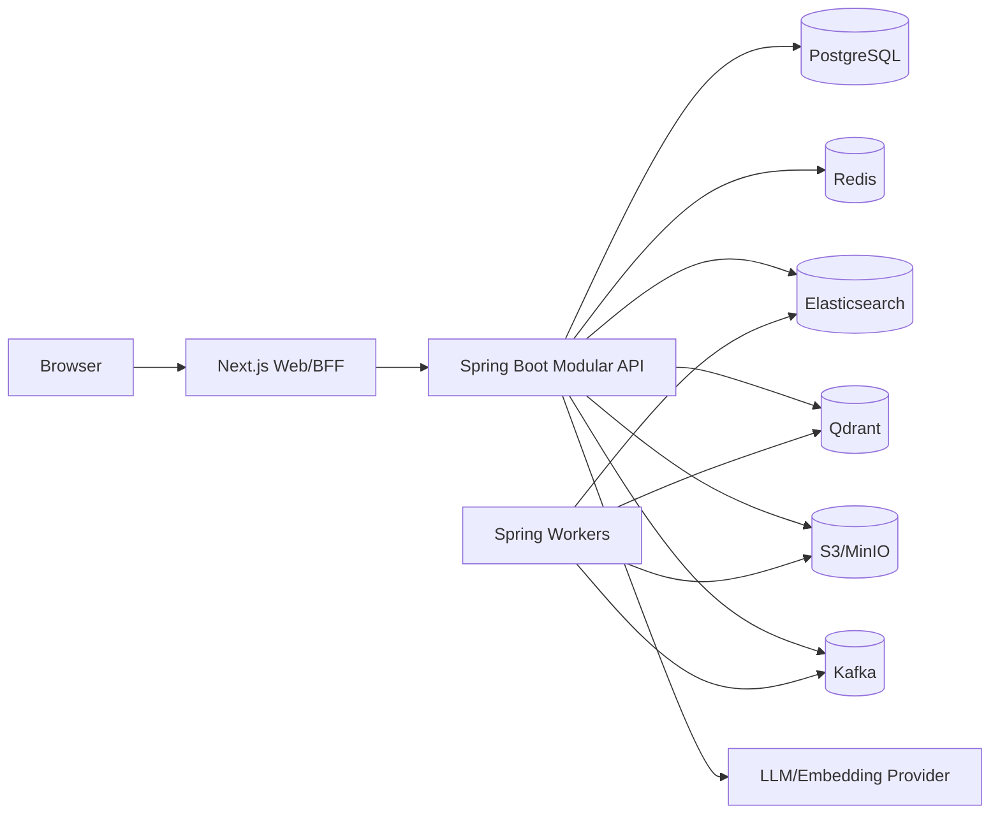

# System Architecture

## Deployment shape

Use a modular monolith initially. Packages/modules must not directly reach into another module's repositories. Communicate through application services, explicit read contracts, and domain events. Transactional outbox records reliable events; consumers are idempotent.

## Bounded contexts

Identity; organizations/workspaces; projects/tasks; conversations; documents; files; notifications; calendar/meetings; search; AI/knowledge; analytics; administration.

## Reliability

Use request IDs, structured errors, timeouts, bounded retries with jitter, circuit breakers for external providers, idempotency keys for retryable writes, optimistic version fields, outbox delivery, and dead-letter handling. Health endpoints distinguish liveness and readiness.

## Scaling path

Keep API stateless except for externalized session/cache state. WebSocket instances use Redis pub/sub. Search, AI ingestion, analytics, and notifications are first candidates for later extraction. Architecture diagrams must reflect the implementation, not aspiration.

